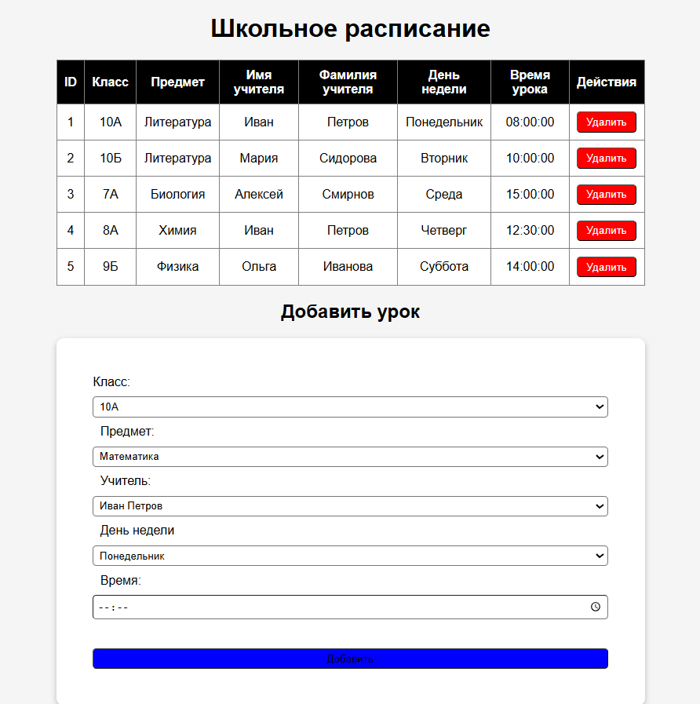

# SchoolArthur — веб-приложение для учебного заведения

## О проекте
Простое веб-приложение для управления информацией учебного заведения.  
Позволяет:
- Управлять студентами и преподавателями (CRUD)
- Вести учет курсов и расписания
- Просматривать информацию через веб-интерфейс.

Проект создан для учебных целей и демонстрации навыков PHP, MySQL, HTML/CSS.

## Стек технологий
- PHP (базовый уровень, работа с формами и MySQL)
- MySQL (структура БД + CRUD операции)
- HTML/CSS (интерфейс)

## Скриншот
### Главная страница

## Установка и запуск
1. Клонировать репозиторий: `git clone https://github.com/rtutra21/schoolArthur.git`
2. Создать базу данных MySQL (название, таблицы описаны в `db.sql`)
3. Настроить подключение к БД в `config.php`
4. Запустить локальный сервер (например, XAMPP, MAMP, Laragon)
5. Открыть `index.php` в браузере

## Что я прокачал
- Реализовал полноценный CRUD через PHP и MySQL
- Создал простой, но функциональный интерфейс
- Настроил структуру проекта и работу с БД

